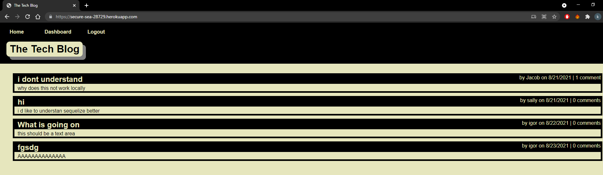

# MVC-Tech-Blog

## Description

A blogsite, users can create posts, comment on posts, edit their own posts! A good place to talk tech!

## Table of Contents

- [Installation](#installation)
- [Usage](#usage)
- [Credits](#credits)
- [License](#license)
- [contributing](#contributing)
- [tests](#tests)
- [questions](#questions)

## Installation

Clone/Fork repo, install packages(npm install),start the server (npm start)

## Usage

To use the app please view the following link: https://secure-sea-28729.herokuapp.com/

## Credits

Jacob

## License

This project is [MIT](https://choosealicense.com/licenses/mit/) licensed. 
Copyright © 2021 [jacob-banks](https://github.com/jacob-banks)

## Contributing

contributions welcome!

## Tests

npm run test

## Questions

Contact Jacob Banks with any questions! 
Github link: [jacob-banks](https://github.com/jacob-banks) 
Email: kobybanks@gmail.com
